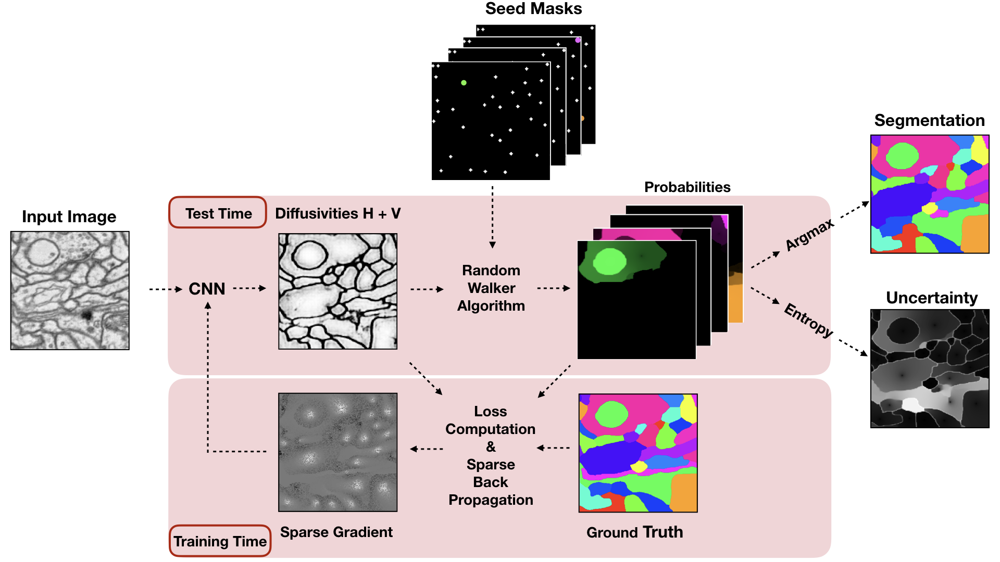

### Abstract
We present an end-to-end learned algorithm for seeded segmentation. Our method is based on the Random Walker algorithm, where we predict the edge weights of the un- derlying graph using a convolutional neural network. This can be interpreted as learning context-dependent diffusiv- ities for a linear diffusion process. After calculating the exact gradient for optimizing these diffusivities, we pro- pose simplifications that sparsely sample the gradient while still maintaining competitive results. The proposed method achieves the currently best results on the seeded CREMI neuron segmentation challenge.

[Download paper here](https://openaccess.thecvf.com/content_CVPR_2019/html/Cerrone_End-To-End_Learned_Random_Walker_for_Seeded_Image_Segmentation_CVPR_2019_paper.html)