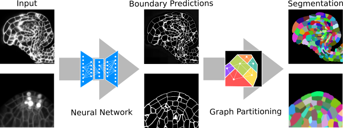

### Abstract
Quantitative analysis of plant and animal morphogenesis requires accurate segmentation of individual cells in volumetric images of growing organs. In the last years, deep learning has provided robust automated algorithms that approach human performance, with applications to bio-image analysis now starting to emerge. Here, we present PlantSeg, a pipeline for volumetric segmentation of plant tissues into cells. PlantSeg employs a convolutional neural network to predict cell boundaries and graph partitioning to segment cells based on the neural network predictions. PlantSeg was trained on fixed and live plant organs imaged with confocal and light sheet microscopes. PlantSeg delivers accurate results and generalizes well across different tissues, scales, acquisition settings even on non plant samples. We present results of PlantSeg applications in diverse developmental contexts. PlantSeg is free and open-source, with both a command line and a user-friendly graphical interface.

[Download paper here](https://elifesciences.org/articles/57613)
