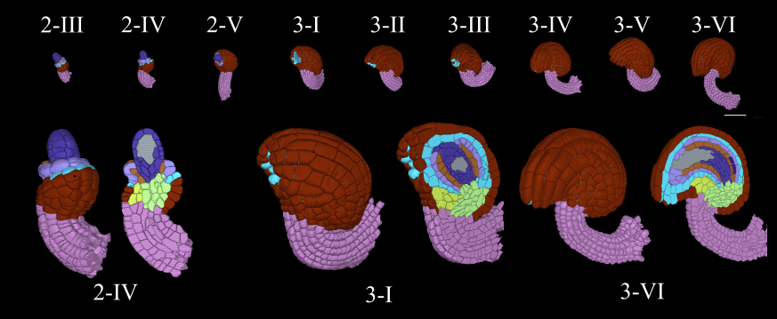

### Abstract
Classifying all cells in an organ is a relevant and difficult problem from plant developmental biology. We here abstract the problem into a new benchmark for node classification in a geo-referenced graph. Solving it requires learning the spatial layout of the organ including symmetries. To allow the convenient testing of new geometrical learning methods, the benchmark of Arabidopsis thaliana ovules is made available as a PyTorch data loader, along with a large number of precomputed features. Finally, we benchmark eight recent graph neural network architectures, finding that DeeperGCN currently works best on this problem.

[Download paper here](https://openaccess.thecvf.com/content/CVPR2022/html/Cerrone_CellTypeGraph_A_New_Geometric_Computer_Vision_Benchmark_CVPR_2022_paper.html)